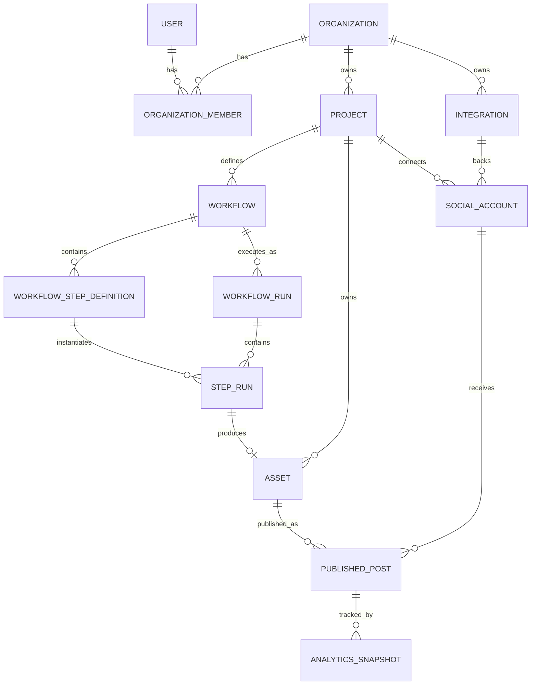

# Platform architecture — SaaS conversion

Status: whiteboard / pre-implementation. This doc records the architecture decisions made while
scoping the conversion of this repo's single-user Python content pipeline into a multi-tenant,
multi-user, workflow-driven SaaS product with web/desktop/mobile clients.

## 1. Decisions log

| Area | Decision | Rationale / notes |
|---|---|---|
| Workflow engine | **Temporal** | Durable execution, retries, and human-in-the-loop pauses (review gates) come for free instead of hand-rolled. |
| Multi-tenancy | **Hybrid**: shared schema + Postgres RLS by default, dedicated database per tenant as an opt-in | Most tenants don't need hard isolation; security-conscious tenants can opt into a dedicated DB without forking the schema. |
| Repo strategy | **Polyrepo** (backend + one repo per client) | Simpler ownership per client; requires a shared API contract (OpenAPI/protobuf) so clients don't drift from the backend. |
| Object storage | **Self-hosted MinIO** (S3-compatible API) for now | Lets us test without committing to a cloud vendor; swappable to Cloudflare R2/S3/B2 later since the API is S3-compatible. Shared bucket, tenant-prefixed keys, presigned URLs for upload/download. |
| Auth | **WorkOS** (managed) | Pricing is per-company/connection rather than per-MAU, which fits an org/tenant-shaped (B2B) product better than Clerk/Auth0/Supabase's per-MAU models. Free up to 1M MAU. |
| Credential/secrets storage | **Encrypted columns in Postgres** (no Vault) | Vault (Community or Enterprise) adds real ops overhead (unseal keys, HA, storage backend) that isn't justified at current scale. Revisit only if a tenant requires it for compliance. |
| Social platforms | **YouTube first, TikTok later** | Scopes the first Integration/publish provider implementation. |
| Deployment target | **Self-hosted, Docker Compose (dev) / Kubernetes (prod)** on our own infrastructure | No managed-cloud-compute dependency; matches the self-hosted-storage/self-hosted-secrets choices above. |
| Backend language/framework | **Python**, staying with the existing stack | Temporal's Python SDK is production-grade; the workload is I/O-bound (call external AI/media APIs, wait, store result) so the GIL doesn't bite; AI provider SDKs ship Python-first; the existing `scripts/providers/` registry and pipeline scripts (`research.py`, `script.py`, `generate_voice.py`, `generate_video.py`, `repurpose.py`, `analytics.py`) get promoted to services instead of rewritten. API layer: **FastAPI** (async, generates OpenAPI natively — feeds the polyrepo shared-contract need). Validation/typing: **Pydantic**. Data layer: **SQLAlchemy + Alembic** for the Postgres model + migrations. Java/.NET were considered but offer no benefit here since there's no in-process CPU-bound hot path to justify JVM/CLR performance. |
| CI/CD | **GitHub Actions** + **GHCR** (container registry) + **ArgoCD** (GitOps deploy to k8s) | GitOps fits the self-hosted k8s target — audit trail and drift detection instead of CI pushing directly. Each polyrepo client repo builds its own artifact independently (web static build, desktop installer per OS, mobile store build); the backend repo builds/pushes images and lets ArgoCD reconcile the cluster. |
| Observability | Self-hosted **Grafana stack**: Prometheus (metrics) + Loki (logs) + Tempo (traces, via OpenTelemetry) + Grafana (dashboards/alerting via Alertmanager) | All self-hostable and integrate with each other and with k8s. Temporal's own Web UI still gives per-workflow/activity visibility; `temporal_workflow_id`/`temporal_activity_id` on WorkflowRun/StepRun cross-link app UI to it. |
| Billing/subscription | Deferred integration; **usage-based metering tied to StepRun volume** is the intended shape when it's built, using **Stripe Billing** as the processor | AI provider calls cost real money per use, so usage-based (vs. seat/flat) protects margin. Not modeled in the schema yet beyond the `Organization` entity being the natural anchor for a future `subscription`/`plan` relation. |
| Desktop client | **Tauri** wrapper (not Electron) | Local file access is required (importing raw footage, exporting renders), which rules out a plain web wrapper. Tauri's Rust shell uses the OS-native webview (smaller binary than Electron) and has a fine-grained filesystem permission model. Electron remains the fallback if a needed native integration is missing from Tauri's plugin ecosystem. |
| Mobile client scope | **Review/approve + analytics only**, no authoring | Confirmed — running research/script/voice/video generation from a phone isn't the workflow; mobile is for approving pending StepRuns and checking AnalyticsSnapshot data. |

## 2. Component recap

- **API layer** — auth (WorkOS), CRUD for Projects/Workflows/Assets, run-triggering, review/approve endpoints.
- **Temporal orchestrator** — one Temporal Workflow per WorkflowRun; one Activity per Step. Handles retries and pause-for-review.
- **Workers** — Temporal worker processes, one activity implementation per step type (research, script, voice, video, repurpose, publish, analytics). These wrap the logic currently in `scripts/research.py`, `scripts/script.py`, `scripts/generate_voice.py`, `scripts/generate_video.py`, `scripts/repurpose.py`, `scripts/analytics.py`.
- **Provider plugin layer** — extension of the existing `scripts/providers/` registry pattern (`base.py`, `registry.py`, `claude.py`, `http.py`) to cover AI text/voice/video providers and, later, social-publish providers.
- **Storage** — Postgres (relational + workflow state), MinIO (media assets).
- **Clients** — web (primary control plane), desktop (Tauri wrapper, needs local file access), mobile (review/approve + analytics, not full authoring).

## 3. Data model

### Entities

- **Organization** — tenant boundary; billing and isolation-mode lives here.
- **User** / **OrganizationMember** — identity (via WorkOS) and org membership with role.
- **Project** — one "channel" within an org (this repo today = exactly one Project).
- **Workflow** / **WorkflowStepDefinition** — a named, versioned sequence of step definitions a Project can run.
- **WorkflowRun** — one execution of a Workflow, tied to a Temporal workflow execution.
- **StepRun** — one execution of a single step within a run, tied to a Temporal activity execution.
- **Asset** — any produced artifact (script, voiceover, video, image, social post copy), versioned.
- **Integration** — encrypted credentials for an AI provider or social platform, scoped to org or project.
- **SocialAccount** — a specific connected channel/account on a platform (e.g. one YouTube channel), backed by an Integration.
- **PublishedPost** — links an Asset to where/when it was published.
- **AnalyticsSnapshot** — metrics pulled back for a PublishedPost over time.

### ERD



### Table sketch

```
Organization
  id (uuid, pk)
  name
  isolation_mode        enum(shared, dedicated)
  dedicated_db_ref       text, nullable   -- secret reference, not a raw connection string
  created_at, updated_at

OrganizationMember
  id (uuid, pk)
  org_id       fk -> Organization
  user_id      fk -> User
  role         enum(owner, admin, editor, viewer)
  created_at

User
  id (uuid, pk)
  workos_user_id   text, unique
  email
  name
  created_at, updated_at

Project
  id (uuid, pk)
  org_id       fk -> Organization   -- tenant column, RLS-enforced
  name
  slug
  channel_config   jsonb   -- voice/tone/provider defaults
  created_at, updated_at

Workflow
  id (uuid, pk)
  org_id       fk -> Organization   -- tenant column
  project_id   fk -> Project
  name
  version      int
  is_active    bool
  created_at, updated_at

WorkflowStepDefinition
  id (uuid, pk)
  workflow_id      fk -> Workflow
  order_index      int
  step_type        enum(research, script, voice, video, repurpose, publish, analytics)
  config           jsonb   -- provider selection + step-specific settings
  requires_review  bool    -- human-in-the-loop gate before advancing
  created_at, updated_at

WorkflowRun
  id (uuid, pk)
  org_id                 fk -> Organization   -- tenant column
  project_id             fk -> Project
  workflow_id            fk -> Workflow
  temporal_workflow_id   text
  status        enum(pending, running, paused_for_review, completed, failed, cancelled)
  triggered_by  fk -> User, nullable   -- null if scheduled/automated
  started_at, completed_at
  created_at, updated_at

StepRun
  id (uuid, pk)
  org_id                  fk -> Organization   -- tenant column
  workflow_run_id         fk -> WorkflowRun
  step_definition_id      fk -> WorkflowStepDefinition
  step_type               enum(...)   -- denormalized for fast filtering
  temporal_activity_id    text, nullable
  status         enum(pending, running, awaiting_review, approved, rejected, completed, failed, retrying)
  output_asset_id  fk -> Asset, nullable
  error_message    text, nullable
  attempt_count    int
  started_at, completed_at
  created_at, updated_at

Asset
  id (uuid, pk)
  org_id         fk -> Organization   -- tenant column
  project_id     fk -> Project
  step_run_id    fk -> StepRun, nullable   -- null for user-uploaded raw inputs
  asset_type     enum(script, voiceover, video, image, social_post, thumbnail, transcript)
  storage_bucket text
  storage_key    text
  mime_type      text
  version        int
  status         enum(draft, in_review, approved, published, archived)
  metadata       jsonb   -- duration, resolution, word count, etc.
  created_by     fk -> User, nullable
  created_at, updated_at

Integration
  id (uuid, pk)
  org_id          fk -> Organization   -- tenant column
  project_id      fk -> Project, nullable   -- null = org-level, set = project-level override
  provider_type   enum(ai_text, ai_voice, ai_video, social_platform)
  provider_name   text   -- "claude", "elevenlabs", "youtube", "tiktok"
  credential_encrypted            bytea
  oauth_refresh_token_encrypted   bytea, nullable
  oauth_expires_at                timestamptz, nullable
  created_at, updated_at

SocialAccount
  id (uuid, pk)
  org_id               fk -> Organization   -- tenant column
  project_id           fk -> Project
  platform             enum(youtube, tiktok)
  external_account_id  text
  integration_id       fk -> Integration
  created_at, updated_at

PublishedPost
  id (uuid, pk)
  org_id             fk -> Organization   -- tenant column
  asset_id           fk -> Asset
  social_account_id  fk -> SocialAccount
  platform_post_id   text
  status             enum(scheduled, published, failed, removed)
  published_at
  created_at, updated_at

AnalyticsSnapshot
  id (uuid, pk)
  org_id              fk -> Organization   -- tenant column
  published_post_id   fk -> PublishedPost
  captured_at         timestamptz
  metrics             jsonb   -- views, watch_time, likes, retention_30s, etc.
  created_at
```

Every tenant-scoped table carries `org_id` so RLS policies can enforce isolation uniformly; the
`Organization.isolation_mode` + `dedicated_db_ref` pair is what the connection-resolver layer reads
to decide whether a query for that org routes to the shared pool or a dedicated database.

## 4. Multi-tenancy implementation notes

- Data-access layer needs a **tenant-aware connection resolver**: look up `Organization.isolation_mode`
  before issuing a query; shared-mode orgs go through the shared pool with RLS (`org_id = current_setting('app.org_id')`),
  dedicated-mode orgs are routed to their own connection (secret pulled from the encrypted credential store, not Vault).
- Migrations must run against the shared DB and fan out across every dedicated DB.
- Provisioning a dedicated DB for a tenant is itself a good candidate for a Temporal workflow
  (create DB, run migrations, store connection secret, flip `isolation_mode`).

## 5. Local dev / self-hosted stack

Services needed for a local Docker Compose environment, based on the decisions above:

- Postgres (shared-tenant DB; dedicated-tenant DBs can be additional containers/instances in dev)
- MinIO (S3-compatible object storage)
- Temporal server + Temporal Web UI
- Backend API service
- Temporal worker service(s) — one process type per step-type group, or one worker binary handling all activity types initially

Production target is the same service set running on Kubernetes rather than Compose.

## 6. Temporal workflow/activity structure

### Parent workflow

One workflow type, `ContentPipelineWorkflow`, per `WorkflowRun`. It orchestrates control flow only —
every DB write and every external API call happens inside an Activity, since Temporal workflow code
must stay deterministic.

```python
@workflow.defn
class ContentPipelineWorkflow:
    def __init__(self) -> None:
        self._review_decisions: dict[str, str] = {}  # step_run_id -> "approved" | "rejected"

    @workflow.run
    async def run(self, workflow_run_id: str) -> None:
        step_defs = await workflow.execute_activity(
            load_step_definitions, workflow_run_id,
            start_to_close_timeout=timedelta(minutes=1),
        )

        for step_def in step_defs:
            step_run_id = await workflow.execute_activity(
                create_step_run, workflow_run_id, step_def.id,
                start_to_close_timeout=timedelta(minutes=1),
            )

            await workflow.execute_activity(
                STEP_ACTIVITY_MAP[step_def.step_type],
                step_run_id,
                task_queue=STEP_TASK_QUEUE[step_def.step_type],
                start_to_close_timeout=timedelta(minutes=30),
                retry_policy=RetryPolicy(
                    maximum_attempts=5,
                    non_retryable_error_types=["InvalidCredentialsError", "ContentPolicyError"],
                ),
            )

            if step_def.requires_review:
                await workflow.execute_activity(mark_awaiting_review, step_run_id, ...)
                await workflow.wait_condition(lambda: step_run_id in self._review_decisions)
                if self._review_decisions.pop(step_run_id) == "rejected":
                    await workflow.execute_activity(mark_run_failed, workflow_run_id, ...)
                    return

            await workflow.execute_activity(mark_step_completed, step_run_id, ...)

        await workflow.execute_activity(mark_run_completed, workflow_run_id, ...)
        await workflow.execute_activity(schedule_analytics_polling, workflow_run_id, ...)

    @workflow.signal
    def approve_step(self, step_run_id: str) -> None:
        self._review_decisions[step_run_id] = "approved"

    @workflow.signal
    def reject_step(self, step_run_id: str, reason: str) -> None:
        self._review_decisions[step_run_id] = "rejected"
```

- `WorkflowRun.temporal_workflow_id` is set deterministically (e.g. `content-run-{workflow_run_id}`) so
  the API can always map a DB row to its Temporal execution and vice versa.
- Review gates use `workflow.wait_condition` on a signal — the workflow blocks durably (no polling, no
  cost while waiting) until the API delivers `approve_step`/`reject_step` in response to a user action
  in the web/mobile client.
- Retries are handled by Temporal's built-in `RetryPolicy` per activity — `StepRun.attempt_count` just
  mirrors Temporal's own attempt counter for display, the app doesn't implement retry logic itself.
  Errors like bad credentials or a content-policy rejection are raised as non-retryable so they fail
  straight to `awaiting_review`/`failed` instead of burning retry attempts.

### Activities (one per step type)

| step_type | Activity | Wraps existing script |
|---|---|---|
| research | `run_research_activity` | `scripts/research.py` |
| script | `run_script_activity` | `scripts/script.py` |
| voice | `run_voice_activity` | `scripts/generate_voice.py` |
| video | `run_video_activity` | `scripts/generate_video.py` |
| repurpose | `run_repurpose_activity` | `scripts/repurpose.py` |
| publish | `run_publish_activity` | new — YouTube/TikTok publish provider |

Each activity is assigned its own **task queue** (`research-tq`, `script-tq`, `voice-tq`, `video-tq`, ...)
so worker pools can scale independently per step type later (e.g. more video workers than research
workers) without changing workflow code — a single worker binary can still serve every task queue to
start, per the local-dev stack in section 5.

### Analytics is a separate, decoupled workflow

Analytics doesn't fit the linear step model — it's a recurring pull over time (multiple
`AnalyticsSnapshot` rows per `PublishedPost`), not a one-shot generate-and-stop step. Rather than
keeping the parent `ContentPipelineWorkflow` alive to poll, it hands off:

- `schedule_analytics_polling` (called once, after publish succeeds) creates a **Temporal Schedule**
  — one per `PublishedPost` — that starts an `AnalyticsPollingWorkflow` on a recurring interval
  (e.g. daily) for a bounded window (e.g. 30 days), then auto-deletes itself.
- Each `AnalyticsPollingWorkflow` run is a single activity call: fetch metrics from the platform API,
  write one `AnalyticsSnapshot` row.
- This keeps the parent `ContentPipelineWorkflow`'s history short-lived and bounded (it completes once
  publish succeeds) instead of needing `continue-as-new` to stay alive indefinitely for analytics.

## 7. Product tiers and target audiences

Two target audiences, confirmed as both in scope: **agencies/teams** and a **determined solo user**.
The multi-tenant data model already supports both without a fork — a solo user is just an
`Organization` with one `OrganizationMember` and one `Project`; an agency is an `Organization` with
many members, many Projects, and role-based access (`OrganizationMember.role`: owner/admin/editor/viewer).
What differs is the value story and which features are worth gating, not the underlying architecture.

### Solo user

- **Value story**: labor replacement — one person doing research, script, voice, video, publish, and
  analytics work that would otherwise take a small team.
- **Price sensitivity**: high — they compare cost against their own time, not a department budget.
- **Doesn't need**: audit trail (they're the only approver), cross-project rollups (they have one Project).

### Agency/team

- **Value story**: scaled quality control — knowing every piece of content published under the
  agency's name cleared a compliance-aware review gate, and knowing which channel/loan officer's
  content is actually working so the pattern can be replicated across the team.
- **Price anchor**: compliance/quality-control value, not "cheaper than hiring help" — a different
  number than the solo tier, not one price trying to work for both.
- **Team-specific features worth building as the paid tier**:
  - **Role-gated approval** — extend `WorkflowStepDefinition.requires_review` (currently a flat
    boolean) to specify *which role* must approve a given step, so e.g. only an "admin" can approve
    the publish step rather than any org member.
  - **Cross-project analytics rollup** — a dashboard aggregating `AnalyticsSnapshot` across every
    `Project` in an `Organization`, surfacing which channel/loan officer is outperforming the others.
    Meaningless for a solo user with a single Project.
  - **Audit trail export** — surfacing the `StepRun` review history (who approved what, when) as a
    compliance artifact, not just internal workflow-engine bookkeeping.

### Sequencing relative to monetization

Both audiences get the core pipeline free/cheap long enough to feel the value (compliance-aware
generation, the analytics-informed feedback loop) before any payment ask — "keep the thing that's
already been working for you" sells better than pricing upfront, especially since it's still
undecided how users will respond to being asked for money at all. The team-specific features above
are the natural paid tier for agencies once that ask comes.

## 8. Open questions (not yet decided)

- Whether/when to actually start monetization (this section defines the tier *shape*; timing itself is still undecided)
